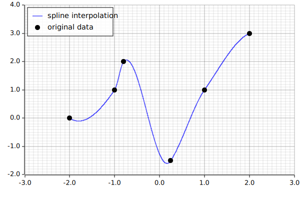
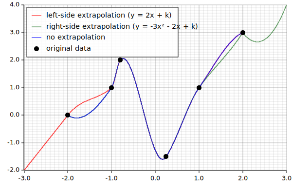

akima_spline
============

[`AkimaSplines`]: https://docs.rs/var_quantity/0.1.0/akima_spline/struct.AkimaSpline.html
[`derivative`]: https://docs.rs/var_quantity/0.1.0/akima_spline/struct.AkimaSpline.html#method.derivative

A lightweight (only one dependency with 18 SLoC) implementation of a 1d Akima
spline with optional smooth extrapolation and derivative calculation.



This crate implements a 1d Akima spline as described in:
> Akima, Hiroshi: A new method of interpolation and smooth curve fitting based on
local procedures. Journal of the Association for Computing Machinery, Vol. 17,
No. 4, October 1970, pp.589-602.

A spline can be constructed by providing x/y data points in the form of two
vectors `xs` and `ys` holding the respective coordinates:

```rust
use akima_spline::AkimaSpline;
use approx;

// Coordinates used in the plot above
let xs = vec![-2.0, -1.0, -0.8, 0.25, 1.0, 2.0];
let ys = vec![0.0, 1.0, 2.0, -1.5, 1.0, 3.0];
let spline = AkimaSpline::new(xs, ys, None, None).expect("valid input data");

// Data inside the spline
approx::assert_abs_diff_eq!(spline.eval(0.2).expect("0.5 is within bounds"), -1.582, epsilon=1e-3);

// Outside the defined points:
assert!(spline.eval(2.2).is_none());

// But it is also possible to evaluate the spline "infallible" via a simple 
// flat interpolation using the last known datapoint:
assert_eq!(spline.eval_infallible(2.2), 3.0);
```

[`AkimaSpline`] also offers the option of providing left-side (`x < xs[0]`)
and right-side (`x > xs[xs.len() - 1]`) extrapolation polynoms. To make sure the
transition between extrapolation and spline is "smooth" (first derivatives equal
at the transition point), the polynoms within the spline are adjusted. This can
be clearly seen when comparing splines made from the same datapoints with and
without extrapolation:



The extrapolation polynoms can be of any degree `n` defined by the length of the
given vector with the first value being the coefficient of the `x^n` term. The
constant part of the polynom is omitted, since it is inferred from the given
datapoints. It is of course possible to extrapolate only on one side (as shown
in the image above) or on both sides.

```rust
use akima_spline::AkimaSpline;

let xs = vec![-2.0, -1.0, -0.8, 0.25, 1.0, 2.0];
let ys = vec![0.0, 1.0, 2.0, -1.5, 1.0, 3.0];

// Polynom 2(x-x0) + k, where k is 0 (first ys-value) and x0 is -2 (first xs-value)
let extrapl = Some(vec![2.0]);

// Polynom 3(x-x0)² - 2(x-x0) + k, where k is 3 (last ys-value) and x0 is 2 (last xs-value)
let extrapr = Some(vec![3.0, -2.0]); 

let spline = AkimaSpline::new(xs, ys, extrapl, extrapr).expect("valid input data");

// Left-side extrapolation
assert_eq!(spline.eval(-2.5).expect("covered by extrapolation polynom"), -1.0);

// Right-side extrapolation
approx::assert_abs_diff_eq!(spline.eval(2.2).expect("covered by extrapolation polynom"), 2.48, epsilon=1e-3);
```

# Derivatives

The spline can be differentiated by an arbitrary degree at any position `x`
using the [`derivative`] method:

```rust
use akima_spline::AkimaSpline;

let xs = vec![-2.0, -1.0, -0.8, 0.25, 1.0, 2.0];
let ys = vec![0.0, 1.0, 2.0, -1.5, 1.0, 3.0];

// Polynom 3(x-x0)² - 2(x-x0) + k, where k is 3 (last ys-value) and x0 is 2 (last xs-value)
let extrapr = Some(vec![3.0, -2.0]); 

// Only right-side extrapolation
let spline = AkimaSpline::new(xs, ys, None, extrapr).expect("valid input data");

// Differentiation inside the spline
// =============================================================================

// Zeroth degree -> This just evaluates the spline
approx::assert_abs_diff_eq!(spline.derivative(0.7, 0).unwrap(), spline.eval(0.7).unwrap(), epsilon=1e-3); 

// First degree derivative
approx::assert_abs_diff_eq!(spline.derivative(0.7, 1).unwrap(), 3.695, epsilon=1e-3);

// Second degree derivative
approx::assert_abs_diff_eq!(spline.derivative(0.7, 2).unwrap(), -0.7, epsilon=1e-3);

// Tenth degree derivative = 0, since AkimaSpline uses a 3rd degree polynom internally
assert_eq!(spline.derivative(0.7, 10).unwrap(), 0.0); 

// Differentiation outside the spline
// =============================================================================

// Differentiation to the left of the data points fails (no extrapolation defined)
assert!(spline.derivative(-2.5, 1).is_none()); 

// Differentiation to the right succeeds (simply differentiate extrapr)
assert_eq!(spline.derivative(2.5, 1).unwrap(), -5.0); 

// Derivatives near the transition points are very similar, because of the enforced
// smoothness of the extrapolation.
approx::assert_abs_diff_eq!(spline.derivative(1.999, 1).unwrap(), -1.43, epsilon=1e-3);
approx::assert_abs_diff_eq!(spline.derivative(2.0, 1).unwrap(), -1.442, epsilon=1e-3);
approx::assert_abs_diff_eq!(spline.derivative(2.0001, 1).unwrap(), -2.05, epsilon=1e-3);

```

The full documentation is available at <https://docs.rs/akima_spline/0.1.0>.

# Serialization and deserialization

The [`AkimaSplines`] struct can be serialized / deserialized if the `serde`
feature is enabled. The serialized representation only stores the raw data
`xs` and `ys` as well as the extrapolation coefficients (without constant
component `k`).

# Alternatives

- [makima_splines](https://crates.io/crates/makima_spline) implements the same
algorithm from Hiroshi Akima as this crate and extrapolates using the leftmost /
rightmost internal polynom of the spline (see their README.md)
- [scirs2-interpolate](https://crates.io/crates/scirs2-interpolate) reimplements
SciPy's interpolation module in Rust, offering Akima spline interpolation
besides various other algorithms.
- [peroxide](https://crates.io/crates/peroxide) offers a variety of tools for
scientific computing, including Akima spline interpolation.

# Documentation

The full API documentation is available at
[https://docs.rs/akima_spline/0.1.0/akima_spline/](https://docs.rs/akima_spline/0.1.0/akima_spline/).

The doc images are created by a second crate `docs/create_doc_images` which uses
this crate and the awesome [plotters](https://crates.io/crates/plotters) crate.
The images shown in this documentation can be created with `cargo run` from
within `docs/create_doc_images`.